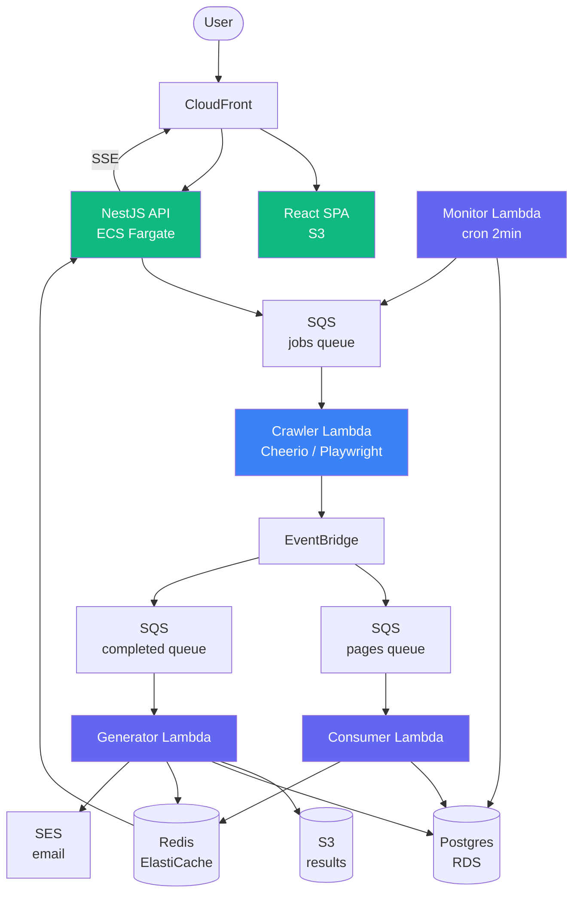

# llms.txt Generator

An automated tool that crawls any website and generates a structured [llms.txt](https://llmstxt.org/) file — the emerging standard for making websites AI-readable.

**Live at [llmtxtgenerator.online](https://llmtxtgenerator.online)**

  

---

## Features

- **Paste a URL, get llms.txt** — crawl any website and receive a structured llms.txt file conforming to the [llmstxt.org spec](https://llmstxt.org/)
- **Dual crawler engine** — Cheerio (HTTP + parse) for server-rendered sites, Playwright for SPAs. Automatic detection via heuristic
- **Real-time progress** — SSE streaming + polling fallback shows pages discovered as they're crawled
- **Email notifications** — logged-in users receive an email when their crawl completes (SES)
- **OAuth login** — Google and GitHub sign-in alongside email+password
- **Resilient architecture** — Lambda workers with continuous checkpointing to Postgres. Jobs survive Lambda timeouts via a resurrection monitor that detects stale jobs and re-enqueues them
- **Dark developer-tool UI** — built with React, Tailwind, Inter + JetBrains Mono. Terminal-style progress view, code-block result preview

---

## Cheerio vs Playwright

We benchmarked both engines across 9 real-world sites at full scale (maxDepth=10000, maxPages=10000) to make a data-driven decision:

| Site             | Cheerio             | Playwright           | Speed ratio |
| ---------------- | ------------------- | -------------------- | ----------- |
| camel.apache.org | 9,439 pages / 17min | 10,002 pages / 16min | ~1x         |
| configcat.com    | 1,170 / 55s         | 1,170 / 117s         | **C 2x**    |
| mariadb.com      | 10,004 / 37min      | 10,001 / 169min      | **C 4.6x**  |
| postman.com      | 735 / 2.5min        | 790 / 12.4min        | **C 5x**    |
| nextiva.com      | 1,591 / 2.5min      | 1,596 / 30min        | **C 12x**   |
| printify.com     | 492 / 32s           | 1 (blocked)          | C wins      |

**Decision:** Cheerio as default (~5x faster average, same output quality for server-rendered sites, better bot resilience). Playwright reserved as an SPA-only fallback — activated when the heuristic detects an empty HTML shell with `#root`/`#app` containers and no static `<a>` links.

Full benchmark data: [`docs/benchmark_cheerio_vs_playwright.md`](docs/benchmark_cheerio_vs_playwright.md)

---

## Architecture



Event-driven with checkpoint/resume. Each page is persisted individually as it's crawled. A resurrection monitor detects stale jobs and re-enqueues them. The generator waits for all pages via `pagesEmitted` synchronization before building the final llms.txt.

**[Detailed architecture documentation →](docs/architecture.md)** covers job lifecycle, database schema, queue topology, race condition analysis, failure modes, and the resurrection flow.

### Packages

| Package              | Runtime            | Purpose                                                                         |
| -------------------- | ------------------ | ------------------------------------------------------------------------------- |
| `packages/shared`    | Library            | Types, Prisma client, Redis pub/sub, URL utils, llms.txt generator, email (SES) |
| `packages/crawler`   | Lambda (container) | BFS crawler — Cheerio + Playwright. Emits events to EventBridge                 |
| `packages/consumer`  | Lambda (zip)       | Persists pages to Postgres, publishes progress to Redis                         |
| `packages/generator` | Lambda (zip)       | Builds llms.txt, uploads to S3, sends completion email                          |
| `packages/monitor`   | Lambda (zip)       | Cron: detects stale jobs, re-enqueues for resurrection                          |
| `packages/api`       | ECS Fargate        | NestJS: auth, job CRUD, SSE progress, content proxy                             |
| `packages/web`       | CloudFront/S3      | React SPA: Vite + Tailwind                                                      |

---

## Project structure

```
llm-crawler/
├── packages/
│   ├── api/                  # NestJS API (ECS Fargate)
│   │   ├── src/
│   │   │   ├── auth/         # JWT + Google/GitHub OAuth strategies, guards, controller
│   │   │   ├── jobs/         # Job CRUD, SQS enqueue, S3 presigned URLs
│   │   │   ├── session/      # Anonymous session middleware + service
│   │   │   ├── sse/          # Server-Sent Events controller (Redis Pub/Sub → browser)
│   │   │   ├── types/        # Express request augmentation (user, sessionId)
│   │   │   └── health.controller.ts
│   │   ├── tests/
│   │   └── Dockerfile
│   ├── crawler/              # Crawler Lambda (container image)
│   │   ├── src/
│   │   │   ├── crawl.ts      # BFS crawler engine (Cheerio)
│   │   │   ├── spa-crawler.ts # SPA navigation via history.pushState
│   │   │   ├── spa-detector.ts # Heuristic: is this an SPA?
│   │   │   ├── handler.ts    # Lambda entry point
│   │   │   ├── event-emitter.ts # EventBridge publisher
│   │   │   ├── fetcher.ts    # HTTP + Playwright fetch
│   │   │   └── parser.ts     # HTML → title, description, links
│   │   ├── tests/
│   │   └── Dockerfile
│   ├── consumer/             # Consumer Lambda (zip)
│   │   ├── src/handler.ts    # Persists pages, publishes progress
│   │   └── tests/
│   ├── generator/            # Generator Lambda (zip)
│   │   ├── src/handler.ts    # Builds llms.txt, uploads to S3, emails user
│   │   └── tests/
│   ├── monitor/              # Monitor Lambda (zip, cron)
│   │   ├── src/handler.ts    # Stale job detection + resurrection
│   │   └── tests/
│   ├── shared/               # Shared library
│   │   ├── src/
│   │   │   ├── types.ts      # JobMessage, PageCrawledEvent, JobCompletedEvent
│   │   │   ├── prisma.ts     # PrismaClient singleton + pingPrisma
│   │   │   ├── redis.ts      # Redis Pub/Sub + pingRedis
│   │   │   ├── generator.ts  # llms.txt builder (groups by path segment)
│   │   │   ├── url-utils.ts  # URL normalization, skippable extensions
│   │   │   ├── email.ts      # SES job completion email
│   │   │   └── logger.ts     # Structured JSON logger for CloudWatch
│   │   └── tests/
│   └── web/                  # React SPA (CloudFront/S3)
│       ├── src/
│       │   ├── pages/        # HomePage, LoginPage, JobPage, DashboardPage
│       │   ├── components/   # Layout, AuthModal, ProgressView, ResultView, JobCard
│       │   ├── hooks/        # useJobStream (SSE), useAuth
│       │   ├── context/      # AuthContext (JWT cookie-based)
│       │   └── api.ts        # API client with 401 auto-refresh
│       └── tests/
├── infra/                    # Terraform
│   ├── main.tf               # Root module wiring
│   ├── variables.tf
│   └── modules/
│       ├── networking/       # VPC, subnets, security groups
│       ├── database/         # RDS Postgres 16
│       ├── redis/            # ElastiCache Redis 7.1
│       ├── storage/          # S3 buckets (results + SPA)
│       ├── queues/           # SQS queues + DLQs
│       ├── events/           # EventBridge bus + rules
│       ├── lambdas/          # 4 Lambda functions + IAM
│       ├── api/              # ECS cluster + ALB + task def
│       ├── cdn/              # CloudFront + Route 53
│       ├── ses/              # Domain verification + DKIM
│       └── monitoring/       # CloudWatch dashboards + alarms
├── prisma/
│   ├── schema.prisma         # Database schema (shared by all packages)
│   └── migrations/           # Prisma migrate history
├── prisma.config.ts          # Prisma v7 config (datasource URL)
├── benchmark/                # Cheerio vs Playwright comparison script
├── .github/workflows/
│   ├── ci.yml                # PR checks: lint, test, schema drift, tf validate
│   └── deploy.yml            # Deploy: selective builds + smoke tests
├── scripts/
│   └── smoke-test.sh         # Post-deploy E2E verification
├── eslint.config.mjs         # ESLint 9 flat config
├── .prettierrc.json
└── turbo.json                # Turborepo pipeline config
```

---

## Tech stack

| Layer            | Technology                                                           |
| ---------------- | -------------------------------------------------------------------- |
| **Frontend**     | React 18, Vite, Tailwind CSS, React Router v6                        |
| **API**          | NestJS 10, Passport (JWT + Google OAuth + GitHub OAuth)              |
| **Crawling**     | Cheerio (HTTP), Playwright + @sparticuz/chromium (SPAs)              |
| **Database**     | PostgreSQL 16 (RDS), Prisma v7 (WASM engine + PrismaPg adapter)      |
| **Cache**        | Redis 7.1 (ElastiCache) — Pub/Sub only                               |
| **Queue**        | SQS + EventBridge                                                    |
| **Storage**      | S3 (results), CloudFront (CDN)                                       |
| **Email**        | Amazon SES (domain-verified with DKIM)                               |
| **Compute**      | Lambda (crawl workers), ECS Fargate (API)                            |
| **Infra**        | Terraform, split into 10 modules                                     |
| **CI/CD**        | GitHub Actions — selective deploys, smoke tests, schema drift checks |
| **Monitoring**   | CloudWatch (4 dashboards + 8 alarms), SNS email alerts               |
| **Code quality** | ESLint 9 (flat config), Prettier, husky + lint-staged                |
| **Testing**      | Vitest, React Testing Library, happy-dom                             |
| **Monorepo**     | Turborepo + npm workspaces                                           |

---

## Local development

### Prerequisites

- Node.js >= 20.19 (required by Prisma v7 CLI)
- Docker (for local Postgres, or use a remote DB)
- AWS CLI configured (for S3/SQS/SES access)

### Setup

```bash
git clone https://github.com/joacripp/llm-crawler.git
cd llm-crawler
npm install
npx prisma generate    # required before build
npm run build
npm run test           # 194 tests across 7 packages
```

### Running locally

```bash
# API (needs DATABASE_URL, REDIS_URL, JOBS_QUEUE_URL, S3_BUCKET, JWT_SECRET)
cd packages/api && npm run start:dev

# Frontend (proxies /api to localhost:3000)
cd packages/web && npm run dev
```

The frontend dev server runs at `http://localhost:5173` with hot reload.

### Useful commands

```bash
npm run lint           # ESLint
npm run lint:fix       # ESLint with auto-fix
npm run format         # Prettier --write
npm run format:check   # Prettier --check
```

---

## Testing strategy

### Current: unit tests (194 tests)

All tests are unit tests with mocked dependencies using Vitest. Coverage by area:

| Area                | Tests | What's covered                                                                                     |
| ------------------- | ----- | -------------------------------------------------------------------------------------------------- |
| **API controllers** | 54    | Auth (signup/login/refresh/logout/OAuth), jobs (CRUD), session middleware, SSE, health             |
| **Web (React)**     | 40    | All pages (Home, Login, Job, Dashboard), hooks (useJobStream, useAuth), API client (refresh/retry) |
| **Shared**          | 36    | URL utils, llms.txt generator, Redis pub/sub, Prisma ping, email helper, types                     |
| **Crawler**         | 26    | BFS crawl, SPA detection, event emitter chunking, handler lifecycle                                |
| **Generator**       | 17    | S3 upload, DB cleanup, race guard (pagesEmitted sync), idempotency, email notification             |
| **Consumer**        | 11    | Page persistence, job status transitions, partial batch failure reporting                          |
| **Monitor**         | 10    | Stale job detection, re-enqueue, progress-based failure, max invocations                           |

### Smoke tests (post-deploy E2E)

After every deploy, a smoke test job runs in CI (`scripts/smoke-test.sh`) that verifies the full system end-to-end against the live environment:

1. **Liveness** — `GET /api/health` returns `200` + `status=ok`
2. **Readiness** — `GET /api/health/ready` confirms DB + Redis + schema are up
3. **SPA shell** — CloudFront returns `index.html` with `#root` element
4. **Cheerio crawl** — creates a job for `configcat.com` (server-rendered, 3 pages), polls until completed, verifies llms.txt content starts with `# `
5. **Playwright crawl** — creates a job for `blut.studio` (SPA, 3 pages), same verification

Each crawl uses a fresh anonymous cookie jar and small bounds (`maxDepth=1, maxPages=3`) so it completes in minutes. Failure in any step fails the deploy workflow.

### Missing: load and stress tests

The current test suite validates correctness but not performance. Gaps:

- **No load testing** — how many concurrent crawls can the system handle before Lambda throttling, RDS connection exhaustion, or SQS backpressure kicks in?
- **No stress testing** — what happens when a crawl hits a 10,000-page site? Memory profile of the crawler Lambda, consumer batch processing under sustained load, generator handling of large page sets
- **No chaos testing** — what if Redis goes down mid-crawl? What if RDS has a maintenance window? The resurrection monitor should handle it, but we haven't verified
- **No end-to-end integration tests** — the smoke test covers the happy path but not edge cases (SPA that changes structure mid-crawl, sites that rate-limit, sites with infinite pagination)

These are the next priority for hardening the system before production traffic.

---

## CI/CD strategy

### Pull requests (`ci.yml`)

Every PR runs:

1. **Lint** — ESLint with 0 errors required
2. **Format check** — Prettier, no drift allowed
3. **Build** — full Turborepo build across all 7 packages
4. **Test** — 194 unit tests via Vitest
5. **Schema drift check** — applies Prisma migrations to a throwaway Postgres, diffs against `schema.prisma`. Catches forgotten `prisma migrate dev` after schema edits
6. **Terraform validate** — syntax + provider check on infra/

### Deploy to production (`deploy.yml`)

Triggered on push to `main`:

1. **Test** — same as PR (lint, format, build, test)
2. **Change detection** — `git diff HEAD~1` determines which packages changed
3. **Selective deploy** — only deploys affected components:
   - `packages/web/` → S3 sync + CloudFront invalidation
   - `packages/api/` → Docker build + ECR push + ECS force-new-deployment
   - `packages/crawler/` → Docker build + ECR push + Lambda update
   - `packages/consumer|generator|monitor/` → esbuild bundle + Lambda zip update
   - `infra/` → Terraform apply
4. **Smoke test** — post-deploy verification:
   - `/api/health` → 200 + `status=ok`
   - `/api/health/ready` → DB + Redis + schema check
   - SPA shell loads with `#root`
   - End-to-end crawl via Cheerio path (configcat.com, 3 pages)
   - End-to-end crawl via Playwright path (blut.studio, 3 pages)

### Pre-push hooks (husky)

```bash
npx prisma generate && npm run build && npm run test
```

Runs before every `git push`. Catches build/test failures before CI.

### Pre-commit hooks (lint-staged)

- `*.{ts,tsx,js,mjs}` → `eslint --fix` + `prettier --write`
- `*.{json,md,yml,yaml}` → `prettier --write`
