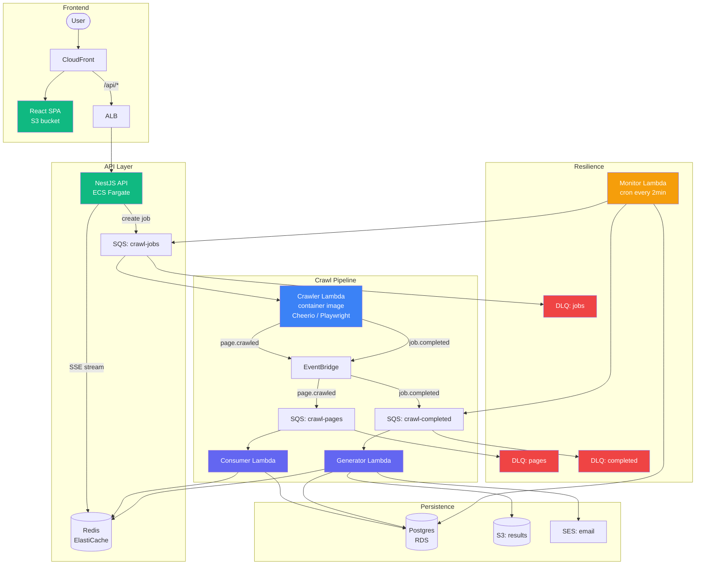
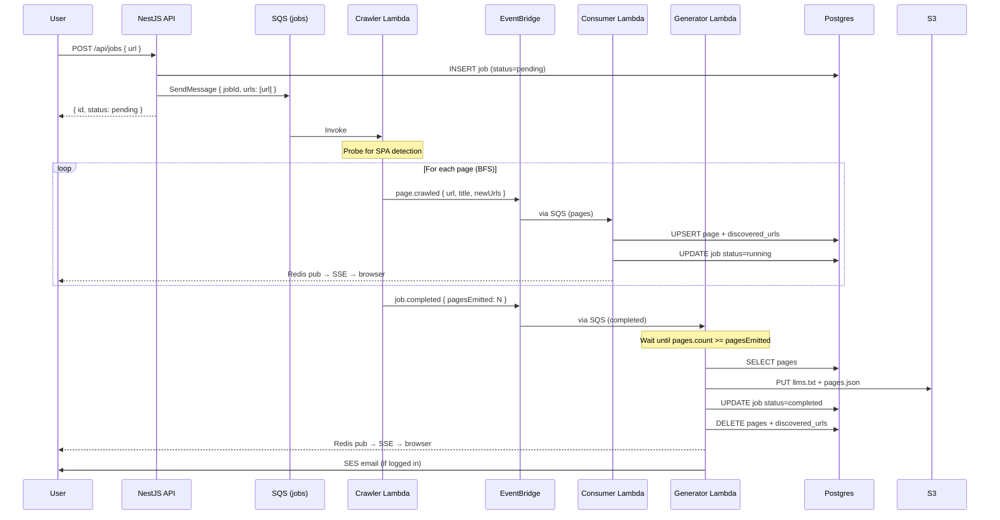
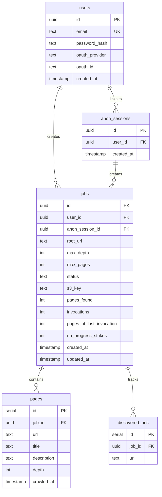

# Architecture

## Overview

The llms.txt Generator is an event-driven crawling pipeline on AWS. A user submits a URL, a Lambda worker crawls the site, and the result is a structured llms.txt file stored in S3.

The core design constraint: **a single crawl can run for 15+ minutes and consume hundreds of MBs of memory.** A monolithic backend would crash under concurrent users. The solution decouples crawling into stateless Lambda workers with continuous checkpointing to Postgres and event-driven coordination via EventBridge + SQS.

---

## System diagram



---

## Job lifecycle



---

## Database schema



**Lifecycle of `pages` and `discovered_urls`:** these tables are transient. The consumer writes to them during a crawl; the generator reads `pages` to build llms.txt, then deletes both. After completion, only the `jobs` row persists (with `s3_key` pointing to the result and `pages_found` storing the final count).

---

## Key design decisions

### Event-driven with checkpoint/resume

A single crawl can run for 15+ minutes and consume hundreds of MBs. Rather than a monolithic backend that crashes under load, the architecture decouples crawling into Lambda workers with continuous checkpointing to Postgres.

Each page is persisted individually as it's crawled — not batched at the end. If the Lambda dies at page 150 of 200, those 150 pages are safe in Postgres. The resurrection monitor picks up the remaining 50.

### Lambda hard-kill resilience

Lambda does NOT send SIGTERM on timeout — it kills the process instantly. The architecture assumes the worker can die at any moment:

- **State is in the database, not in memory.** The crawler emits events per page; the consumer persists them immediately.
- **The resurrection monitor** (cron every 2 min) queries for jobs with `status='running'` and `updated_at` older than 3 minutes. It computes `pending = discovered_urls - pages` (the URLs we found but haven't crawled yet) and re-enqueues them.
- **Invocation tracking** (`invocations` column) prevents infinite loops — after 10 attempts, the job is marked `failed`.

### Generator/consumer sync via `pagesEmitted`

The `page.crawled` and `job.completed` events flow through different SQS queues. SQS provides no ordering guarantee between queues, so the generator can run before all pages are persisted.

**The problem:** if the crawler emits 5 pages and only 2 are persisted when the generator runs, it builds an incomplete llms.txt.

**The fix:** the crawler passes `pagesEmitted: N` on the `job.completed` event — the exact number of `page.crawled` events it sent. The generator compares this against `pages.count` in the database:

```
if pages.count < pagesEmitted → throw → SQS retries after visibility timeout
if pages.count >= pagesEmitted → proceed to build llms.txt
```

The completed queue has a 30-second visibility timeout (not the default 300s) so retries happen quickly.

**Idempotency:** if the job is already `completed` or `failed` when the generator runs (a stale SQS retry), it skips silently instead of throwing.

### Progress-based failure detection

The monitor can't distinguish "Lambda died mid-flight" from "this job will never succeed" (e.g., SPA false-positive causing Playwright to crash every attempt). A simple retry counter wastes ~30 minutes before giving up.

**The fix:** track `pages_at_last_invocation` and `no_progress_strikes`:

```
for each stale job:
  currentPages = count(pages WHERE job_id)
  if invocations > 0 AND currentPages <= pages_at_last_invocation:
    strikes++
    if strikes >= 2: mark failed (give up after ~6 min)
  else:
    strikes = 0 (progress detected)
  re-enqueue with updated counts
```

### Consumer status protection

The consumer processes `page.crawled` events and updates the job status. But these events can arrive after the generator has already marked the job `completed` (different queues, no ordering).

**The fix:** the consumer uses `updateMany` with a `WHERE status='pending'` / `WHERE status='running'` clause. It never matches `completed` or `failed` jobs, so it can't clobber a terminal status.

### Per-record error handling

The consumer's SQS event source has `batch_size=10`. Previously, one bad record crashed the entire batch — SQS retried all 10, and if the bad one kept failing, all 10 went to the DLQ.

**The fix:** per-record try/catch, returning `SQSBatchResponse` with `batchItemFailures`. Only the failed record gets retried. Requires `function_response_types = ["ReportBatchItemFailures"]` on the Lambda event source mapping.

---

## Queue topology

```
SQS: crawl-jobs (visibility: 960s, DLQ after 3 receives)
  └── Triggers: Crawler Lambda (batch_size=1)

SQS: crawl-pages (visibility: 60s, DLQ after 3 receives)
  └── Triggers: Consumer Lambda (batch_size=10, ReportBatchItemFailures)

SQS: crawl-completed (visibility: 30s, DLQ after 5 receives)
  └── Triggers: Generator Lambda (batch_size=1)
```

**Why different visibility timeouts:**

- `crawl-jobs` (960s = 16 min): the crawler Lambda timeout is 15 min. Visibility must exceed Lambda timeout to prevent re-delivery while still running.
- `crawl-pages` (60s): the consumer runs in <5s per batch. 60s gives headroom for cold starts.
- `crawl-completed` (30s): the generator runs in <5s. Short timeout so `pagesEmitted` sync retries happen quickly (the generator may need 1-2 retries for the consumer to catch up).

---

## Monitoring

### CloudWatch dashboards

| Dashboard                    | Purpose                                                                                        |
| ---------------------------- | ---------------------------------------------------------------------------------------------- |
| `llm-crawler-dev-operations` | Queue backlog, DLQ depth, max queue age, Lambda errors/throttles, ECS tasks, API 5xx + latency |
| `llm-crawler-dev-pipeline`   | Queue age over time, depth (visible + in-flight), per-Lambda duration, concurrent executions   |
| `llm-crawler-dev-database`   | RDS CPU/memory/IOPS/connections, Redis CPU/memory/evictions                                    |
| `llm-crawler-dev-cost`       | Daily Lambda invocations, avg duration, crawler memory, ECS utilization, S3 bucket size        |

### Alarms (SNS email)

| Alarm                | Condition                      |
| -------------------- | ------------------------------ |
| DLQ not-empty (x3)   | Any message in a DLQ for 1 min |
| Lambda errors (x4)   | >5 errors in 10 min            |
| ECS no running tasks | <1 task for 2 min              |

---

## Infrastructure

All resources are managed by Terraform, split into 11 modules:

| Module       | Resources                                           |
| ------------ | --------------------------------------------------- |
| `networking` | VPC, public/private subnets, security groups        |
| `database`   | RDS Postgres 16, parameter group                    |
| `redis`      | ElastiCache Redis 7.1                               |
| `storage`    | S3 buckets (results + SPA), lifecycle rules         |
| `queues`     | 3 SQS queues + 3 DLQs                               |
| `events`     | EventBridge bus + routing rules                     |
| `lambdas`    | 4 Lambda functions, IAM role, event source mappings |
| `api`        | ECS cluster, task def, ALB, target group, Route 53  |
| `cdn`        | CloudFront distribution, Route 53                   |
| `ses`        | Domain verification, DKIM records                   |
| `monitoring` | 4 dashboards, 8 alarms, SNS topic                   |

State is stored in S3 (`llm-crawler-terraform-state`) with DynamoDB locking.
